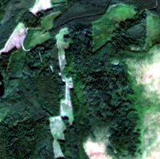
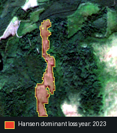
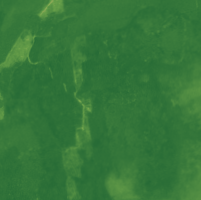
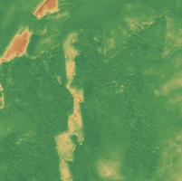

# Отчёт за 14.09–20.09

**Проект:** «Интеллектуальная система классификации нарушений лесного покрова по спутниковым данным»  
**Команда:** 4

## 1. Цель работы за период

Сформулировать прикладную задачу проекта, подготовить исходные данные по России и собрать первый рабочий контур инструмента для просмотра forest-loss samples, спутниковых данных и вспомогательной разметки.

Основная цель первого отчётного периода — перейти от разрозненных CSV/GeoJSON и спутниковых источников к локальному исследовательскому приложению, в котором можно выбрать точку, посмотреть её на карте, запустить первичный анализ Hansen/Sentinel и сохранить состояние работы в базе.

## 2. Источники данных

В проекте используются три основных источника данных.

### 2.1. Global Drivers of Forest Loss

В качестве исходной разметки используется набор **Global drivers of forest loss at 1 km resolution**. Он описывает доминирующий драйвер потери древесного покрова для ячеек примерно 1 км и содержит training/validation samples.

Документация и загрузка:

- Zenodo: [Global drivers of forest loss at 1 km resolution](https://zenodo.org/records/19485190)
- Google Earth Engine Data Catalog: [WRI/Google DeepMind Global Drivers of Forest Loss 2001-2025 v1.3](https://developers.google.com/earth-engine/datasets/catalog/projects_landandcarbon_assets_wri_gdm_drivers_forest_loss_1km_v1_3_2001_2025)
- WRI Data Explorer: [Global drivers of forest loss at 1 km resolution](https://datasets.wri.org/datasets/dominant-drivers-of-tree-cover-loss-at-1km)

Использованные файлы:

- `training_2001_2025_v1_3.csv`
- `validation_2001_2022.geojson`

### 2.2. Hansen Global Forest Change

Для определения года события потери леса используется **Hansen Global Forest Change 2000–2025 v1.13**. Основной слой для текущего контура — `lossyear`: он кодирует год потери леса как смещение от 2000 года.

Документация и загрузка:

- [Global Forest Change 2000-2025 Data Download](https://storage.googleapis.com/earthenginepartners-hansen/GFC-2025-v1.13/download.html)
- [GLAD Global Forest Change viewer](https://glad.earthengine.app/view/global-forest-change)
- Google Earth Engine asset: `UMD/hansen/global_forest_change_2025_v1_13`

В проекте Hansen используется не как финальная ground truth-разметка, а как вспомогательный источник для:

- определения dominant event year;
- выделения точек, слишком старых для дальнейшей проверки по Sentinel-2;
- построения масок потери леса;
- подготовки первых численных признаков для ML.

### 2.3. Sentinel-2 L2A / Copernicus Data Space

Для визуальной проверки событий и подготовки спутниковых признаков используется **Sentinel-2 L2A** через Copernicus Data Space / Sentinel Hub API.

Документация:

- Copernicus Data Space APIs: [APIs overview](https://documentation.dataspace.copernicus.eu/APIs.html)
- STAC catalogue: [STAC product catalogue](https://documentation.dataspace.copernicus.eu/APIs/STAC.html)
- Sentinel-2 L2A: [Sentinel-2 L2A documentation](https://documentation.dataspace.copernicus.eu/APIs/SentinelHub/Data/S2L2A.html)
- Sentinel Hub S2L2A data notes: [Sentinel-2 L2A](https://docs.sentinel-hub.com/api/latest/data/sentinel-2-l2a/)

Для проекта важное ограничение: Sentinel-2 L2A практически пригоден для нашего PRE/EVENT/POST-подхода только начиная с 2016 года. Поэтому события, которые по Hansen произошли раньше 2016 года, выделяются в отдельный статус `Too old` - для таких точек нельзя корректно собрать сопоставимый Sentinel-2 контекст до/во время/после события.

## 3. Что было сделано

- Сформулирована задача проекта: разработать инструмент для исследования и дальнейшей классификации нарушений лесного покрова по спутниковым данным.
- Подготовлен Python-скрипт для извлечения точек, относящихся к России, из исходных forest datasets.
- Сформирован набор `TestData/Forest/Init_Extracted` с нормализованными данными по России.
- Создан локальный инструмент `Scripts/ResearchTool` на FastAPI + HTML/CSS/JavaScript.
- Для хранения состояния выбран SQLite-файл `Scripts/ResearchTool/Data/forest/state.sqlite`.
- Реализована базовая схема данных: samples, manual validation, analysis statuses, Hansen metadata, Sentinel metadata, derived previews и exports.
- Добавлен импорт CSV/GeoJSON в базу.
- Реализован Forest UI: карта, список точек, фильтры, выбор sample и карточка выбранной точки.
- Реализован batch-контур Hansen-анализа для samples.
- Добавлен статус `Too old` для точек, у которых Hansen event year меньше 2016.
- Добавлены research-скрипты для массового кэширования Hansen tiles и простановки старых точек.
- Добавлен UI-фильтр `Valid for new search`, который исключает точки со статусом `Too old`.
- Улучшен UI выбора точек: клик по точке на карте синхронизируется со списком samples.
- Улучшен Sentinel UI: снимки сгруппированы по `PRE`, `EVENT`, `POST`; основной слой показывается как `RGBA`, дополнительные слои раскрываются по клику.
- Реализована генерация derived previews для Sentinel-2: RGB, False Color, NDVI, NBR, NDMI и SCL.
- Добавлен первичный ML-контур для Hansen-признаков и XGBoost baseline.

## 4. Полученные результаты

### 4.1. Подготовленный набор данных

После фильтрации исходных данных по России получен единый набор forest samples.

| Характеристика | Результат |
|---|---:|
| Всего samples | 1 178 |
| Samples из `training_2001_2025_v1_3.csv` | 841 |
| Samples из `validation_2001_2022.geojson` | 337 |
| Количество классов `driver_primary` | 7 |
| High confidence | 845 |
| Medium confidence | 215 |
| Low confidence | 118 |

Распределение по основным классам:

| Класс | Количество |
|---|---:|
| Wildfire | 452 |
| Logging | 302 |
| Other natural disturbances | 150 |
| Hard commodities | 120 |
| Noise/non-forest | 66 |
| Settlements & infrastructure | 57 |
| Permanent agriculture | 31 |

### 4.2. Структура локального инструмента

| Компонент | Реализация |
|---|---|
| Backend | FastAPI |
| Frontend | HTML/CSS/JavaScript, Leaflet |
| База состояния | SQLite + SQLAlchemy ORM |
| Основной режим | `Forest` |
| Дополнительный режим | `Pipeline` |
| Исходные данные | `TestData/Forest/Init`, `TestData/Forest/Init_Extracted` |
| Cache | `Scripts/ResearchTool/Data/cache/forest` |
| База | `Scripts/ResearchTool/Data/forest/state.sqlite` |

### 4.3. Состояние базы Forest

| Таблица / показатель | Результат |
|---|---:|
| `forest_samples` | 1 178 |
| `forest_manual_validations` | 710 |
| `forest_sample_statuses` | 1 888 |
| `forest_hansen_analyses` | 1 259 |
| Уникальные samples с Hansen-анализом | 1 178 |
| `forest_hansen_tiles` | 47 |
| `forest_sentinel_searches` | 84 |
| `forest_sentinel_downloads` | 174 |
| `forest_derived_previews` | 1 044 |
| `forest_hansen_masks` | 5 041 |
| `forest_exports` | 2 |

Manual validation:

| Статус | Количество |
|---|---:|
| Too old | 691 |
| Valid | 55 |
| Wrong | 5 |
| Unclear | 21 |

Hansen statuses:

| Статус | Количество |
|---|---:|
| TOO_OLD | 712 |
| GOOD | 321 |
| AMBIGUOUS | 225 |
| NO_LOSS | 1 |

### 4.4. Hansen-анализ

Для всех 1 178 samples появился Hansen-анализ. На его основе были автоматически выделены старые события:

- для точек с `event_year < 2016` добавлен статус `TOO_OLD`;
- для таких точек массово проставлена ручная разметка `Too old`;
- подготовлен prefetch-скрипт для кэша Hansen tiles;
- слой `treecover2000` оставлен опциональным, так как для определения года события достаточно `lossyear`.

Для каждой точки берётся квадратная область анализа вокруг sample. Внутри неё читается растр `lossyear`: значение `0` означает отсутствие события, значения `1..25` соответствуют годам `2001..2025`. Далее строится гистограмма площади потери леса по годам:

```text
A_y = N_y · S_pixel
```

где `N_y` — количество пикселей с годом потери `y`, а `S_pixel` — площадь одного пикселя Hansen. После этого выбирается доминирующий год:

```text
event_year = argmax_y A_y
dominant_share = A_event_year / Σ A_y
```

То есть `event_year` — год, на который приходится максимальная площадь потери леса внутри анализируемой области, а `dominant_share` показывает, насколько событие сконцентрировано в одном году. Если год меньше 2016, точка получает статус `TOO_OLD`, потому что для неё нельзя корректно собрать Sentinel-2 PRE/EVENT/POST-контекст.

Кэш Hansen:

| Слой | Количество tile records |
|---|---:|
| `lossyear` | 43 |
| `treecover2000` | 4 |

### 4.5. Sentinel-2 PRE/EVENT/POST

В базе сохранены результаты поиска и скачивания Sentinel-2 L2A.

| Показатель | Результат |
|---|---:|
| Sentinel searches | 84 |
| Скачанные GeoTIFF | 174 |
| Metadata JSON | 174 |
| Derived previews | 1 044 |
| Derived layers на один download | 6 |

Распределение скачанных снимков по периодам:

| Период | Количество |
|---|---:|
| PRE | 59 |
| EVENT | 62 |
| POST | 53 |

Derived layers:

| Слой | Количество PNG |
|---|---:|
| RGB | 174 |
| False Color | 174 |
| NDVI | 174 |
| NBR | 174 |
| NDMI | 174 |
| SCL | 174 |

RGB-снимок Sentinel-2 от 2024-09-08:



RGB-снимок от 2024-09-08 с наложенной Hansen-разметкой доминирующего года потери леса:



Примеры индексных слоев для той же точки:





### 4.6. XGBoost baseline по Hansen-признакам

**Цель.** Проверить, различает ли Hansen-анализ типы нарушений лесного покрова, и получить baseline для дальнейших сравнений с моделью на спектральных признаках.

**Данные.** 1 178 точек. Из них 754 относятся к двум массовым классам: Wildfire (452) и Logging (302). Остальные классы (`Other natural disturbances`, `Hard commodities`, `Noise/non-forest`, `Settlements & infrastructure`, `Permanent agriculture`) имеют менее 150 точек каждый и в первом эксперименте объединялись в `Other`.

**Признаки.** Три числовых признака, рассчитанных по Hansen `lossyear`:

- `hansen_loss_fraction` — доля площади потерь от площади окна;
- `hansen_recent_loss_5y` — доля потерь за последние 5 лет;
- `hansen_dominant_share` — доля доминирующего года от всех потерь.

**Эксперимент 1 (7 классов, с координатами).** F1-macro = 0.411. Feature importance: `lat` = 0.232, `lon` = 0.216, все Hansen-признаки вместе = 0.552. Координаты оказались сопоставимы по важности с физическими признаками, что указывает на утечку: модель частично классифицирует по региону, а не по событию. Этот результат не отражает реальную предсказательную способность Hansen.

**Эксперимент 2 (2 класса, без координат).** После удаления `lat`/`lon` и сужения задачи до двух классов Logging/Wildfire получен F1-macro = 0.682 при accuracy 0.692. Feature importance выровнялась: три Hansen-признака дают 0.30, 0.35 и 0.35. Это подтверждает, что модель опирается именно на Hansen-метрики.

**Интерпретация confusion matrix.** Из 754 точек правильно классифицированы 522. Основная ошибка — взаимная путаница Logging ↔ Wildfire: 110 Logging предсказаны как Wildfire и 122 Wildfire как Logging. Это ожидаемо: Hansen не различает причину потери, а только её факт. И вырубка, и пожар дают высокий `loss_fraction` и часто высокий `dominant_share`.

**Вывод.** Hansen-признаков достаточно для baseline-различения Logging и Wildfire (F1 = 0.68). Дальнейшее улучшение качества требует спектральных признаков Sentinel-2 (NDVI, NBR, dNBR), поскольку Hansen не содержит информации о характере нарушения — только о его факте и годе.

## 5. Что означают текущие статусы

На текущем этапе статусы используются не как финальная классификация, а как рабочий механизм очистки и маршрутизации точек.

| Статус | Смысл |
|---|---|
| `Too old` | Событие произошло раньше 2016 года; для него нельзя корректно собрать Sentinel-2 PRE/EVENT/POST-контекст, поэтому точка исключается из нового Sentinel-поиска. |
| `Valid` | Точка потенциально пригодна для дальнейшего анализа. |
| `Wrong` | Точка признана неподходящей или ошибочной. |
| `Unclear` | По текущим данным нельзя уверенно принять решение. |
| `GOOD` | Hansen-анализ дал согласованный год события. |
| `AMBIGUOUS` | Hansen показывает событие, но метрики недостаточно однозначны. |
| `NO_LOSS` | В выбранной области Hansen не показывает loss event. |

## 6. План на следующую неделю

- Добавить таблицу `forest_sentinel_scene_reviews`.
- Реализовать UI `Mark bad` / `Restore` для Sentinel картинок со спутника с информацией в панели найденных снимков.
- Сделать отдельный PRE/POST compare-view с двумя синхронными raster-панелями.
- Обновить итерационный отчёт после завершения следующей итерации.
- Зафиксировать минимальный датасет с однозначными снимками + их разметкой.
- Провести эксперимент с разметкой через RemoteClip модель.
