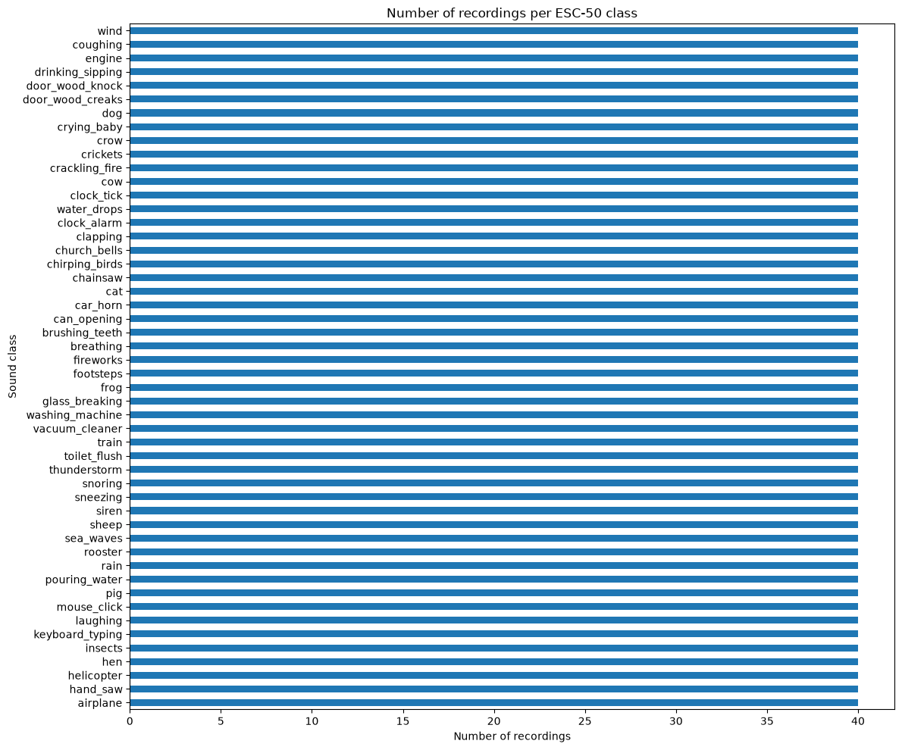
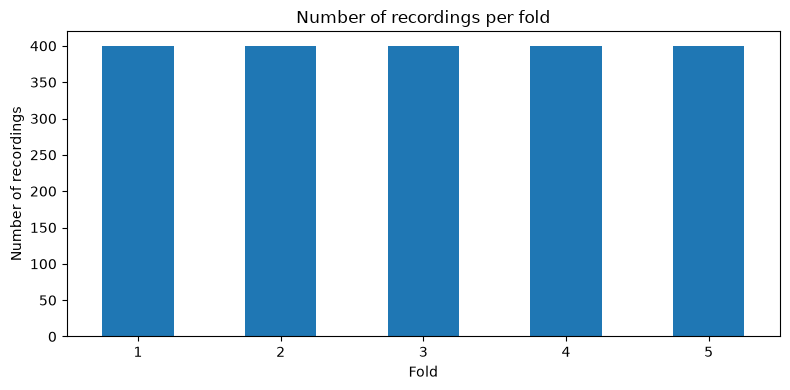
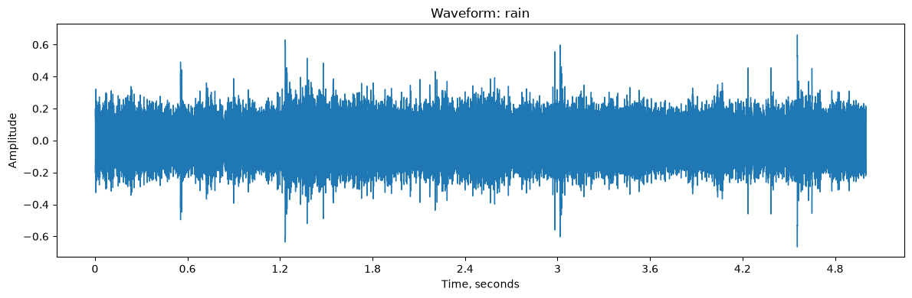
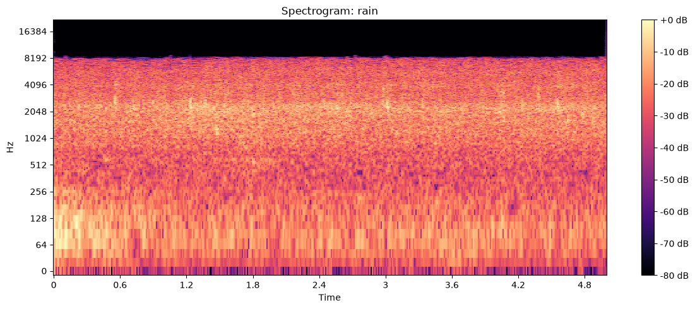

# Отчёт за 07.09–13.09

**Проект:** «Распознавание окружающих звуков»  
**Команда:** 8

## 1. Цель работы на неделю

Сформулировать задачу проекта и требования к минимальной версии приложения, подготовить воспроизводимое окружение разработки, выбрать и загрузить набор данных, а также провести его первичное исследование.

## 2. Что было сделано

- Сформулирована задача: разработать веб-приложение, которое принимает короткую аудиозапись и возвращает три наиболее вероятных класса окружающего звука с оценками уверенности.
- Определены функции минимальной версии: загрузка и прослушивание аудиофайла, получение результатов классификации, отображение waveform и спектрограммы.
- Выбран технологический стек: Python 3.12, NumPy, pandas, librosa, SoundFile, Matplotlib, JupyterLab, scikit-learn, FastAPI и HTML/CSS/JavaScript.
- Создан Python-проект `sound-recognition` с пакетной структурой `src`.
- Для управления Python, виртуальным окружением и зависимостями настроен `uv`.
- Создано изолированное окружение `.venv` на Python 3.12.14; зависимости зафиксированы в `pyproject.toml` и `uv.lock`.
- В качестве основного набора данных выбран ESC-50.
- Датасет загружен из официального репозитория и размещён локально в `data/ESC-50`.
- Проверены метаданные, распределение записей по классам и fold, форматы и технические характеристики аудиофайлов.
- Подготовлен воспроизводимый notebook `notebooks/01_esc50_exploration.ipynb`.
- В notebook добавлены таблицы, графики распределения данных, аудиоплееры для примеров пяти классов, waveform и спектрограмма записи класса `rain`.
- Notebook проверен чистым запуском `Restart Kernel and Run All Cells`; все девять кодовых ячеек выполнились без ошибок.

## 3. Полученные результаты

### 3.1. Окружение проекта

| Параметр | Результат |
|---|---|
| Операционная система | macOS, Apple Silicon |
| Python | 3.12.14 |
| Менеджер проекта | uv 0.12.13 |
| Виртуальное окружение | `.venv` |
| Файл зависимостей | `pyproject.toml` |
| Lock-файл | `uv.lock` |

Тестовая консольная команда проекта `uv run sound-recognition` успешно запускается. JupyterLab работает в виртуальном окружении проекта.

### 3.2. Проверка ESC-50

| Характеристика | Результат |
|---|---:|
| Количество аудиофайлов | 2 000 |
| Количество строк метаданных | 2 000 |
| Количество классов | 50 |
| Записей в каждом классе | 40 |
| Количество fold | 5 |
| Записей в каждом fold | 400 |
| Дубликаты имён файлов | 0 |
| Отсутствующие аудиофайлы | 0 |
| Формат | WAV, PCM 16-bit |
| Частота дискретизации | 44 100 Гц |
| Количество каналов | 1, mono |
| Длительность записи | 5 секунд |

Данные сбалансированы по классам и fold. Для дальнейшей оценки моделей будут сохранены пять предопределённых fold, поскольку они предотвращают попадание фрагментов одного исходного файла в разные части выборки.

### 3.3. Первичная визуализация

В исследовательском notebook построены:

- горизонтальная диаграмма количества записей в каждом из 50 классов;
- диаграмма распределения 2 000 записей по пяти fold;
- waveform пятисекундной записи дождя;
- логарифмическая спектрограмма этой же записи;
- аудиоплееры для классов `dog`, `keyboard_typing`, `rain`, `sea_waves` и `siren`.

Waveform показывает изменение амплитуды сигнала во времени, а спектрограмма — распределение его энергии по времени и частоте. Для выбранного примера длительностью 5 секунд при частоте 44 100 Гц получено 220 500 отсчётов.

## 4. Ссылки на изменения

- Репозиторий проекта: [sound-recognition](https://github.com/djentdjentdjent/sound-recognition)
- Коммит за первую неделю: [f459c55](https://github.com/djentdjentdjent/sound-recognition/commit/f459c556fac02016dbb3e4480695dd2d7fa9e581)
- Исследовательский notebook: [01_esc50_exploration.ipynb](https://github.com/djentdjentdjent/sound-recognition/blob/main/notebooks/01_esc50_exploration.ipynb)

## 5. План на следующую неделю

- Определить параметры единого аудиоформата для модели.
- Реализовать загрузку аудио и преобразование в mono.
- Добавить приведение записей к единой частоте дискретизации и длительности.
- Исследовать нормализацию громкости.
- Извлечь MFCC и другие базовые аудиопризнаки.
- Проверить признаки на примерах разных классов.
- Перенести подготовку аудио из notebook в повторно используемый Python-модуль.
