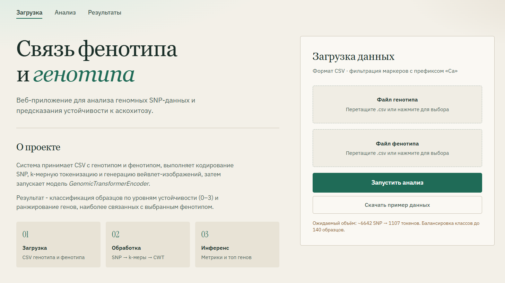
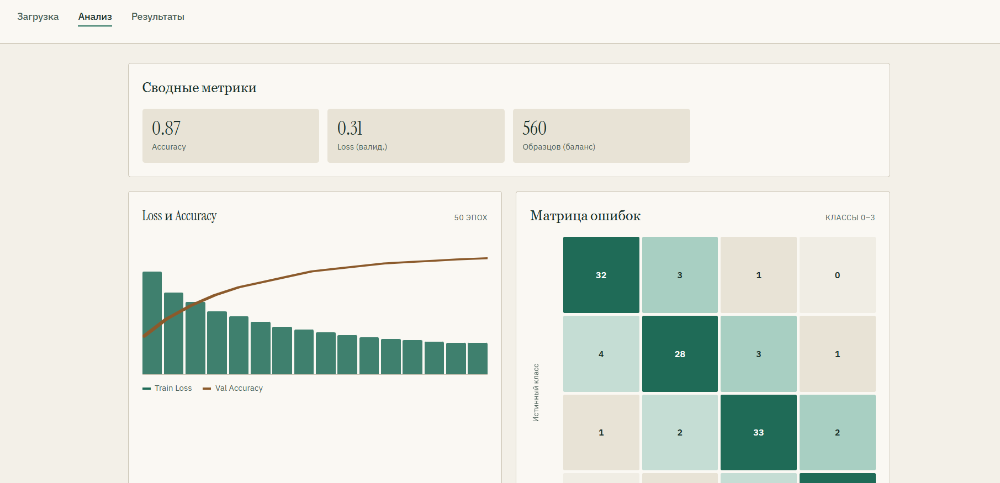
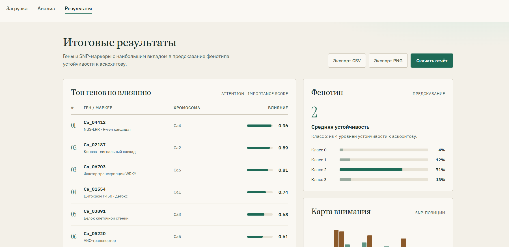

# Отчет за 28.09-04.10

Составили html-макеты для страниц веб-приложения (файлы приложены в директории)

Всего в приложении будет три страницы:
1. Привественная с описанием проекта и возможностью загрузить входные данные для анализа

2. Промежуточные результаты и небольшие выкладки с графиками

3. Итоговые результаты с выбранными генами для данного фенотипа и описанием их

